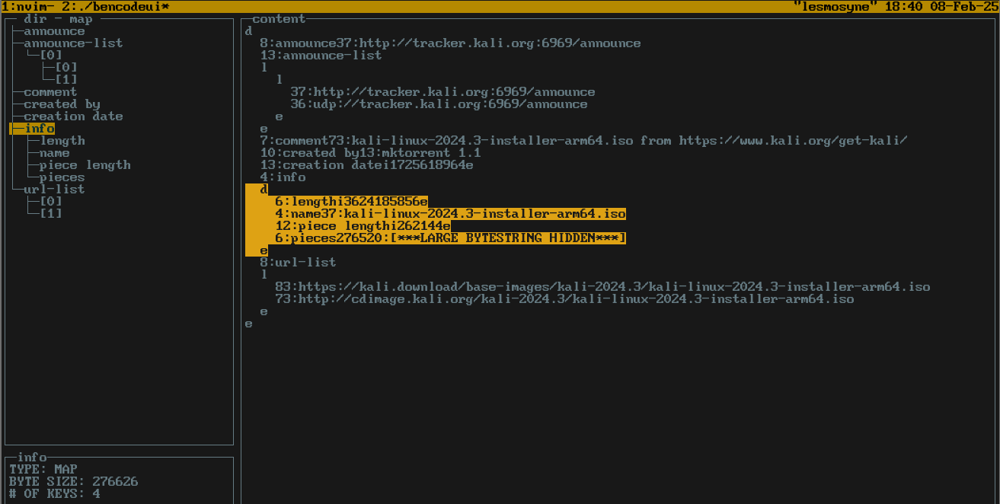

# bencodeui

bencodeui is a command line user interface tool to view the contents of a bencoded file built using the [gocui](https://github.com/jroimartin/gocui) library



## What is bencode? 

[bencode](https://en.wikipedia.org/wiki/Bencode) is a data serialization format that shares many similarities with JSON. However the way in which bencode is encoded differs greatly.

bencode supports four different types of values:

- byte strings, encoded as `<length>:<contents>`

- integers, encoded as `i<base10 integer>e`

- lists, encoded as `l<elements>e` 
- dictionaries (associative arrays), encoded as `d<pairs>e`

The bencode format is most commonly used in .torrent files.
read more about bencode [here](https://en.wikipedia.org/wiki/Bencode)

## How do I use bencodeui? 

1. clone this repository 

2. ensure go is installed on your system. Then navigate to the project dir and run 

```go build```

3. then run `bencodeui` with a path to the bencode file you would like to view as the first and only argument

```./bencodeui /path/to/bencode/file```
